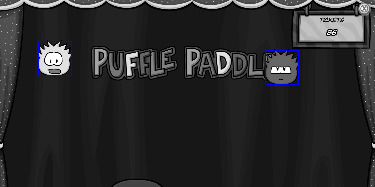

# Puffle Paddle

**English** | [Português (BR)](README.pt-BR.md)

An autoplayer for **Puffle Paddle**, a Club Penguin fair minigame.

The program captures a fixed region of the screen, runs classic computer vision on it (background subtraction → threshold → contour detection), finds the puffle that is lowest on screen and moves the mouse to that x position, so the paddle stays under it.



> [!NOTE]
> This is a study project for computer vision and screen automation. Use it at your own risk.

---

## How it works

The whole pipeline runs at a target of 60 FPS:

1. **Screen capture** of a fixed region of interest (ROI) — `XShm` (shared memory) in C++, `mss` in Python.
2. **Background subtraction** — `cv::absdiff` between the current frame and `images/background.png`.
3. **Thresholding** — converts the difference image into a binary mask (`MASK_THRESH`).
4. **Contour detection** — external contours smaller than `OBJECT_MIN_AREA` are ignored (noise, small sprites).
5. **Centroid of the lowest object** — the contour with the largest `y` wins; that's the puffle closest to falling.
6. **Mouse control** — the cursor x follows the puffle's centroid; y is fixed at the bottom of the ROI. Off by default, toggled with the keyboard.

A debug window shows the ROI with a bounding box drawn around every detected object.

## Implementations

| | C++ | Python |
|---|---|---|
| Entry point | [`src/main.cpp`](src/main.cpp) | [`src/main.py`](src/main.py) |
| Screen capture | X11 / XShm | `mss` |
| Mouse control | `XWarpPointer` | `pyautogui` |
| Dependencies | OpenCV, X11 | `opencv-python`, `mss`, `numpy`, `pyautogui` |
| Platform | Linux (X11) | Cross-platform |

Both versions share the same constants, ROI and behaviour — the Python version is a direct port of the C++ one.

## Requirements

**C++**

- CMake ≥ 3.10 and a C++17 compiler
- OpenCV
- X11 development libraries

On Debian/Ubuntu:

```bash
sudo apt install build-essential cmake libopencv-dev libx11-dev libxext-dev
```

**Python**

- Python 3.x
- Dependencies listed in [`requirements.txt`](requirements.txt)

## Getting started

### C++

```bash
cmake -B build
./run.sh
```

Or build manually:

```bash
cmake -B build
cmake --build build
./build/main
```

### Python

```bash
pip install -r requirements.txt
python src/main.py
```

> Run it from the repository root — the program loads `images/background.png` with a relative path.

## Controls

The mouse control starts **disabled**, so you can position the game window first:

| Key | Action |
|---|---|
| `Y` | Enable mouse control |
| `N` | Disable mouse control |
| `Q` | Quit |
| `Ctrl+C` | Quit (terminal) |

## Configuration

These values live at the top of both [`src/main.cpp`](src/main.cpp) and [`src/main.py`](src/main.py):

| Constant | Default | Description |
|---|---|---|
| `roi_x`, `roi_y` | `234`, `140` | Top-left corner of the region of interest on screen |
| `width`, `height` | `1503`, `750` | Size of the region of interest |
| `MASK_THRESH` | `40` | Threshold applied to the background difference image |
| `OBJECT_MIN_AREA` | `10000` | Minimum contour area to count as a puffle |
| `fps` | `60` | Target frame rate |

> [!IMPORTANT]
> `images/background.png` must be captured with the **exact** dimensions of the ROI (`1503×750`) and with no puffles visible, or the detection will break.

## Project structure

```
├── CMakeLists.txt      # C++ build
├── requirements.txt    # Python dependencies
├── run.sh              # Builds and runs the C++ version
├── images/
│   ├── background.png  # Reference background (no puffles)
│   └── exemplo*.png    # Example screenshots
├── src/
│   ├── main.cpp        # C++ version (X11 + OpenCV)
│   └── main.py         # Python version (mss + pyautogui + OpenCV)
└── test/
    └── test.py         # Old experimentation scripts
```
